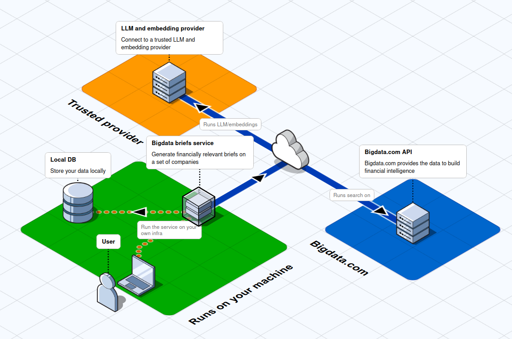

# Briefs with Bigdata.com
This repository contains a docker image for running a brief generating service using Bigdata.com SDK. You can read more on our [docs](https://docs.bigdata.com/use-cases/docker-services/briefs).



# What are Briefs in Bigdata?
Briefs are concise, automated reports generated by Bigdata's platform that help users stay informed about their watchlists and areas of interest. They are personalized market updates that deliver only the most relevant insights based on your watchlist, helping you stay informed without information overload. Unlike traditional newsfeeds or generic newsletters, they're tailored to your interests and can be delivered when you preferred, whether that's daily, weekly or any other frequency you choose.

## Prerequisites
- A [Bigdata.com](https://bigdata.com) account that supports programmatic access.
- A Bigdata.com API key, which can be obtained from your account settings.
    - For more information on how to get an API key, refer to the [Bigdata.com documentation](https://docs.bigdata.com/api-reference/introduction#api-key-beta).
- A watchlist ID with the list of companies you want to generate briefs for.
    - A watchlist can be created using the [Bigdata.com SDK](https://docs.bigdata.com/getting-started/watchlist_management) or through the app @ https://app.bigdata.com/watchlists.

# Quickstart
To quickly get started, you have two options:

1. **Build and run locally:**
You need to build the docker image first and then run it:

```bash
# Clone the repository and navigate to the folder
git clone git@github.com:Bigdata-com/bigdata-briefs.git
cd "bigdata-briefs"

# Build the docker image
docker build -t bigdata_briefs .

# Run the docker image
docker run -d \
  --name bigdata_briefs \
  -p 8000:8000 \
  -e BIGDATA_API_KEY=<bigdata-api-key-here> \
  -e OPENAI_API_KEY=<openai-api-key-here> \
  bigdata_briefs
```

2. **Run directly from GitHub Container Registry:**

```bash
docker run -d \
  --name bigdata_briefs \
  -p 8000:8000 \
  -e BIGDATA_API_KEY=<bigdata-api-key-here> \
  -e OPENAI_API_KEY=<openai-api-key-here> \
  ghcr.io/bigdata-com/bigdata-briefs:latest
```

This will start the brief service locally on port 8000. You can then access the service @ `http://localhost:8000/` and the documentation for the API @ `http://localhost:8000/docs`.

For a custom enterprise-ready solution, please contact us at [support@bigdata.com](mailto:support@bigdata.com)

## Security Measures

We perform a pre-release security scan on our container images to detect vulnerabilities in all components. Stay assured that all critical issues are addressed promptly.

## How to use? Generate a brief for your Bigdata.com watchlist

A brief is an executive summary of financially relevant information about a set of companies that form your watchlist.

### Using the UI
There is a very simple UI available @ `http://localhost:8000/`.

Set your watchlist ID, the relevant dates for your report and whether you want to filter the brief
only to novel information based on previously generated briefs and click on the "Generate Brief" button.

### Programmatically
You can generate a brief by sending a POST request to the `/briefs/create` endpoint with the required
parameters. For example, using `curl`:
```bash
curl -X 'GET' \
  'http://localhost:8000/briefs/create?watchlist_id=db8478c9-34db-4975-8e44-b1ff764098ac&report_start_date=2024-01-01&report_end_date=2024-01-31&novelty=true' \
  -H 'accept: application/json'
```

For more details on the parameters, refer to the API documentation @ `http://localhost:8000/docs`.

# Install and for development locally
```bash
uv sync --dev
```

To run the service, you need an API key from Bigdata.com set on the environment variable `BIGDATA_API_KEY` and additionally provide an API key from a supported LLM provider, for now OpenAI.
```bash
# Set environment variables
export BIGDATA_API_KEY=<bigdata-api-key-here>
export OPENAI_API_KEY=<openai-api-key-here>
```

Then, the following command will start the brief service locally on port 8000.
```bash
uv run -m bigdata_briefs
```

## Tooling
This project uses [ruff](https://docs.astral.sh/ruff/) for linting and formatting and [ty](https://docs.astral.sh/ty/) for a type checker. To ensure your code adheres to the project's style guidelines, run the following commands before committing your changes:
```bash
make type-check
make lint
make format
```
